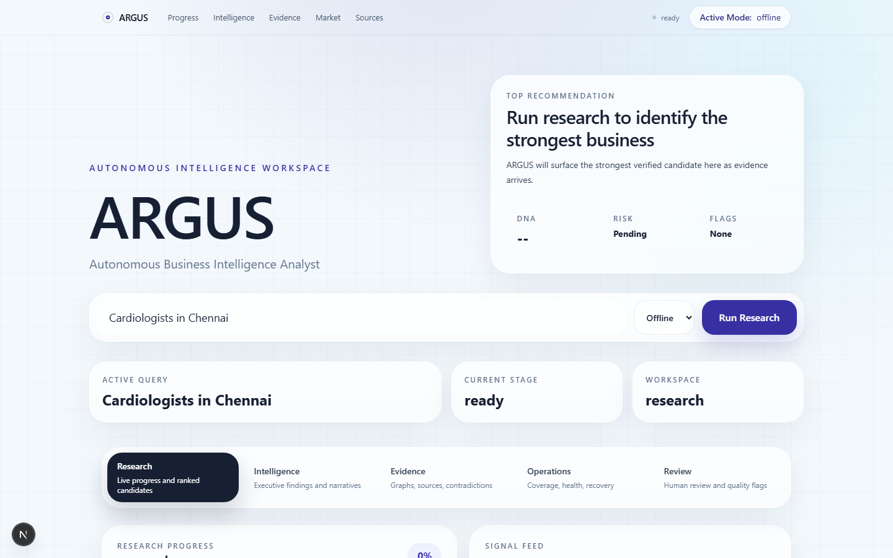
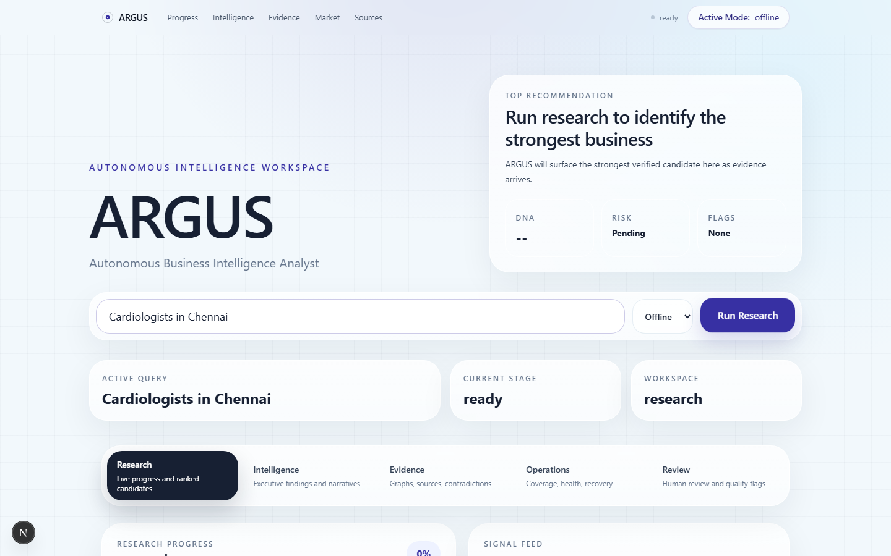
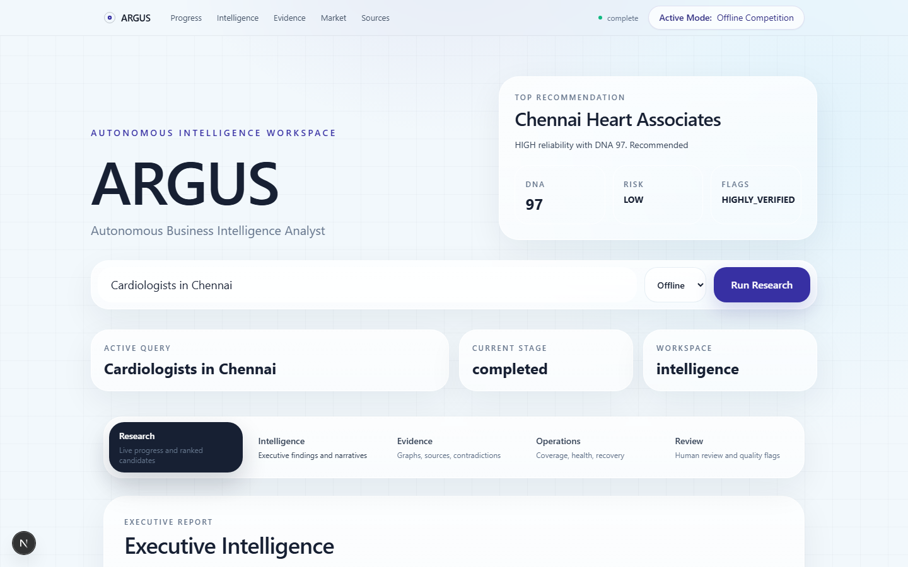
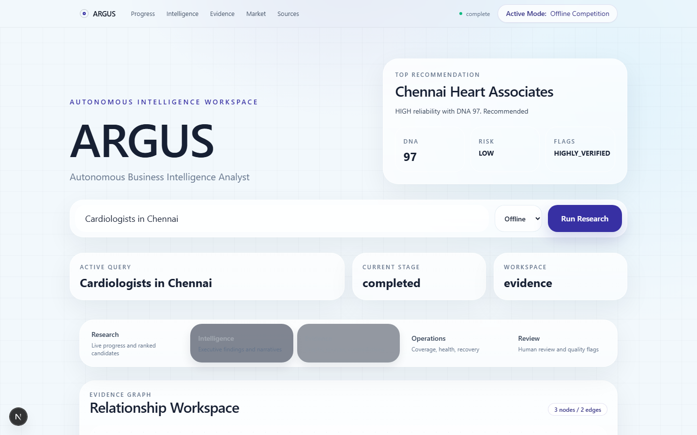
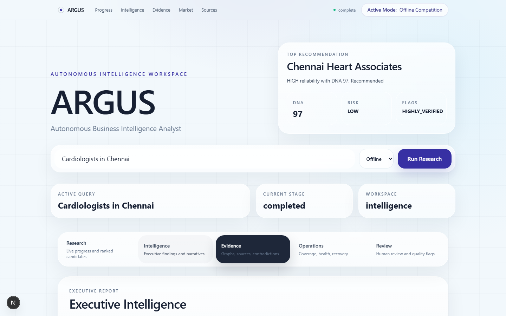
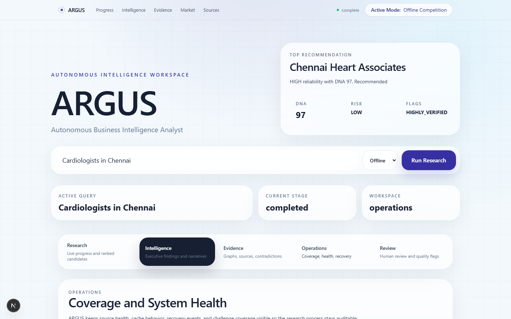

# ARGUS

**Autonomous Business Intelligence Analyst**

ARGUS is a professional business research workspace. Given a query such as `Cardiologists in Chennai`, it understands the category and location, discovers source records, extracts public facts, verifies evidence, detects contradictions, deduplicates businesses, ranks candidates, and produces an executive-ready research report.

Current version: **ARGUS v2.7**

## Why ARGUS Is Not Just A Scraper

Most scrapers return rows. ARGUS returns a research dossier:

- Every fact keeps evidence receipts.
- Conflicting values are preserved instead of guessed away.
- Duplicate records are merged with traceability.
- Sources receive reliability scores.
- Businesses receive Business DNA scores, review flags, and ranked recommendations.
- Research streams progressively through a background worker.
- Reports include evidence graphs, relationship analysis, market intelligence, competitive intelligence, and deterministic executive analyst commentary.

## Challenge Alignment

ARGUS directly addresses the official research-agent requirements:

- Query understanding
- Multi-source discovery
- Official websites, directories, social profiles, review platforms, and licensing/public-record style sources
- Verification and evidence receipts
- Conflict detection
- Deduplication
- Research summary and data quality summary
- Concurrent collection
- Streaming results
- Persistent cache
- Source reliability scoring
- Structured JSON/CSV exports
- Offline competition mode
- Global online mode

## Architecture

```text
User Query
  -> Scout Parser
  -> Background Research Job
  -> Source Planner
  -> Adapter Pack / Search Providers
  -> Collector / Offline Corpus Crawler
  -> Persistent Crawl Cache
  -> Normalizer
  -> Deduplicator
  -> Evidence Store
  -> Conflict Detector
  -> Business DNA
  -> Evidence Graph
  -> Relationship Graph
  -> Market + Competitive Intelligence
  -> Deterministic Executive Analyst
  -> Streaming Research Workspace
```

## Tech Stack

- Backend: FastAPI, SQLAlchemy, Pydantic
- Database: SQLite fallback, PostgreSQL-ready
- Background work: asyncio task worker
- Streaming: Server-Sent Events
- Extraction: httpx, BeautifulSoup, trafilatura
- Deduplication: RapidFuzz
- Frontend: Next.js, TypeScript, Tailwind CSS
- Motion and graph UI: Framer Motion, React Flow
- Tests and smoke: pytest, Playwright
- Legacy fallback: static HTML/CSS/JS

## Modes

- `online`: real public web search and crawl only. No fabricated values.
- `offline`: local offline corpus only. No internet calls.
- `demo`: deterministic demo dataset.
- `auto`: tries online first, then uses offline fallback when needed.

Configure with:

```env
ARGUS_MODE=auto
```

## Offline Competition Mode

Offline Competition Mode is designed for judging rooms where internet access is unreliable. It uses packaged public-source-style HTML/JSON corpus pages and still runs the same pipeline: discovery, crawl, extraction, verification, deduplication, conflict detection, scoring, ranking, streaming, and reporting.

Tamil Nadu offline coverage includes:

- Cities: Chennai, Coimbatore, Madurai, Trichy, Salem, Tirunelveli, Vellore, Erode, Thanjavur, Hosur
- Categories: Cardiologists, Dentists, Plumbers, Electricians, Restaurants, Family Lawyers, Roofing Contractors, Schools, Hospitals, Physiotherapists
- Plus original challenge examples for Birmingham, Austin, Dallas, Chicago, and Houston

## Global Online Mode

Online mode accepts arbitrary categories and locations, including global city/country formats. It uses source planning, open-web search adapters, URL filtering, JSON-LD extraction, contact-page crawling, source-specific heuristics, crawl cache, and failure visibility. Online mode never invents missing values.

## Core Intelligence

- Background worker and true streaming
- Persistent research cache
- Persistent timeline events
- Startup recovery for queued/running jobs
- Adapter pack with source health reporting
- Evidence Graph
- Contradiction Map
- Human Review Queue
- Business DNA
- Source reliability scoring
- Market Intelligence
- Competitive Intelligence
- Relationship Graph and ecosystem summary
- Deterministic Executive Analyst
- Workspace UI organized into Research, Intelligence, Evidence, Operations, and Review
- JSON and CSV exports

## Screenshots

### Research Workspace


### Live Research Progress


### Executive Intelligence


### Evidence Graph


### Editorial Insights


### Operations And Coverage


## One-Command Launch

Windows:

```powershell
npm run start:argus
```

If PowerShell script execution policy blocks the command:

```powershell
powershell -ExecutionPolicy Bypass -File scripts/start_argus.ps1
```

The launcher starts:

- Frontend: `http://localhost:3000`
- Backend: `http://127.0.0.1:8000`
- Swagger: `http://127.0.0.1:8000/docs`

Logs are written to:

```text
artifacts/logs/
```

## Production Deployment

Target deployment:

- Frontend: Vercel
- Backend: Render
- Database: Render PostgreSQL

### Deployment Automation Helper

ARGUS includes a local deployment helper:

```powershell
powershell -ExecutionPolicy Bypass -File scripts/deploy_argus.ps1
```

The helper:

- checks git, Node, npm, and Python
- runs local validation unless `-SkipValidation` is supplied
- checks Vercel CLI availability
- guides Vercel login/link/deploy
- prints the Render Blueprint checklist
- prints required production environment variables
- prints the production smoke-test checklist

Optional flags:

```powershell
powershell -ExecutionPolicy Bypass -File scripts/deploy_argus.ps1 -SkipValidation
powershell -ExecutionPolicy Bypass -File scripts/deploy_argus.ps1 -DeployPreview
powershell -ExecutionPolicy Bypass -File scripts/deploy_argus.ps1 -DeployProduction
powershell -ExecutionPolicy Bypass -File scripts/deploy_argus.ps1 -RenderBackendUrl "https://your-render-backend.onrender.com" -VercelProductionUrl "https://your-vercel-app.vercel.app"
```

Install Vercel CLI if needed:

```powershell
npm install -g vercel
vercel.cmd --version
```

On Windows, prefer `vercel.cmd` if PowerShell blocks the `vercel.ps1` shim.

### Backend Deployment On Render

This repository includes `render.yaml` for a Render Blueprint.

Render backend settings:

- Runtime: Python
- Python: `3.12.10`
- Build command: `pip install -r requirements.txt`
- Start command: `uvicorn backend.main:app --host 0.0.0.0 --port $PORT`
- Health check: `/api/health`
- Swagger: `/docs`

Recommended backend environment variables:

```env
DATABASE_URL=<Render PostgreSQL connection string>
ARGUS_MODE=offline
ARGUS_OFFLINE_MODE=true
ARGUS_DEMO_MODE=false
ARGUS_CACHE_TTL_SECONDS=86400
ARGUS_CRAWL_CACHE_TTL_SECONDS=86400
ARGUS_SEARCH_TIMEOUT_SECONDS=10
ARGUS_MAX_RESULTS_PER_QUERY=10
ARGUS_MAX_SOURCE_QUERIES=12
ARGUS_MAX_PAGES_PER_SITE=4
CORS_ALLOWED_ORIGINS=https://your-vercel-app.vercel.app,http://localhost:3000,http://127.0.0.1:3000
```

`DATABASE_URL` supports Render-style `postgresql://` URLs and is normalized internally to the installed `psycopg` SQLAlchemy driver. If `DATABASE_URL` is missing, ARGUS falls back to local SQLite.

### Frontend Deployment On Vercel

Create a Vercel project using:

- Root directory: `frontend`
- Build command: `npm run build`
- Framework preset: Next.js

Required Vercel environment variable:

```env
NEXT_PUBLIC_ARGUS_API_URL=https://your-render-backend.onrender.com
```

The frontend API client uses `NEXT_PUBLIC_ARGUS_API_URL` for fetch, SSE, cancellation, and recent-job calls.

Vercel CLI flow:

```powershell
cd frontend
vercel.cmd login
vercel.cmd link
vercel.cmd env add NEXT_PUBLIC_ARGUS_API_URL production
vercel.cmd env add NEXT_PUBLIC_ARGUS_API_URL preview
vercel.cmd
vercel.cmd --prod
```

### Production URLs

After deployment:

- Frontend: `https://your-vercel-app.vercel.app`
- Backend: `https://your-render-backend.onrender.com`
- Health: `https://your-render-backend.onrender.com/api/health`
- Swagger: `https://your-render-backend.onrender.com/docs`

### Common Deployment Issues

- CORS errors: add the exact Vercel URL to `CORS_ALLOWED_ORIGINS` on Render.
- Backend cold start: free Render services may sleep; wait for `/api/health` to return.
- Database connection errors: verify `DATABASE_URL` is present and points to Render PostgreSQL.
- Frontend cannot call backend: verify `NEXT_PUBLIC_ARGUS_API_URL` has no trailing markdown brackets or extra spaces.
- Vercel CLI login fails in restricted shells: run `vercel.cmd login` in a normal terminal and complete the browser/device login.
- Render CLI is not required; use the Blueprint flow with `render.yaml`.
- Online mode volatility: use `ARGUS_MODE=offline` for reliable judging, or `auto` if live web fallback is desired.

### Post-Deploy Smoke Test

1. Open `https://your-render-backend.onrender.com/api/health`.
2. Open `https://your-render-backend.onrender.com/docs`.
3. Open `https://your-vercel-app.vercel.app`.
4. Search `Cardiologists in Chennai`.
5. Use Offline or Auto mode.
6. Verify progress appears and the final report completes.
7. Repeat the query and verify the cache banner appears.

### Updating Deployments

1. Push changes to `main`.
2. Render redeploys the backend from `render.yaml` or the connected service.
3. Vercel redeploys the `frontend/` project.
4. Verify `/api/health`, `/docs`, and one query in the frontend.

## Manual Launch

Create and install dependencies:

```powershell
python -m venv .venv
.\.venv\Scripts\activate
pip install -r requirements.txt
pip install -r requirements-dev.txt
npm install
npm --prefix frontend install
copy .env.example .env
```

Backend:

```powershell
.\.venv\Scripts\python.exe -m uvicorn backend.main:app --reload --host 127.0.0.1 --port 8000
```

Next.js frontend:

```powershell
$env:NEXT_PUBLIC_ARGUS_API_URL="http://127.0.0.1:8000"
npm --prefix frontend run dev -- --hostname localhost --port 3000
```

Legacy fallback:

```text
Open index.html directly in a browser.
```

## Demo Queries

- Cardiologists in Chennai
- Plumbers in Coimbatore
- Cardiologists in Birmingham
- Roofing contractors in Dallas
- Restaurants in Tokyo

Recommended judge flow:

1. Run `Cardiologists in Chennai` in Offline mode.
2. Show streaming progress and signal feed.
3. Open Intelligence for executive report, scorecard, SWOT, and recommendations.
4. Open Evidence for React Flow graph, evidence receipts, relationships, and contradictions.
5. Open Review for human-review items.
6. Open Operations for source health, adapter health, cache, and challenge coverage.
7. Export JSON and CSV.
8. Repeat `Cardiologists in Chennai` to show cached research reuse.
9. Run `Restaurants in Tokyo` in Offline mode to show honest unsupported-query handling.

## Validation

Current validation: **92 tests passing**.

```powershell
npm --prefix frontend run build
.\.venv\Scripts\python.exe -m compileall backend tests
.\.venv\Scripts\python.exe -m pytest
node --check app.js
npm run smoke
npm run smoke:next
```

Smoke screenshots are saved in:

```text
artifacts/smoke/
```

## API

- `GET /api/health`
- `POST /api/research/start`
- `GET /api/research/{session_id}`
- `GET /api/research/{session_id}/events`
- `POST /api/research/{session_id}/cancel`
- `GET /api/research/jobs/recent`

## Frontends

- Primary frontend: `frontend/` Next.js research workspace
- Legacy fallback: `index.html`, `styles.css`, `app.js`

The legacy frontend remains intact and is not required for the modern judge-facing workflow.

## Known Limitations

- Online mode depends on live public web availability and may be blocked by search providers.
- Offline Competition Mode uses deterministic packaged corpus pages for reliable offline judging and is clearly labeled.
- No paid APIs are used.
- No Gemini, LLM, RAG, embeddings, or agent framework is included.
- Search adapters are resilient but not a replacement for official paid provider APIs.

## Judge Q&A

**Q: Is this live data?**  
A: ARGUS supports online mode for public web research. For offline finals reliability, it also includes Offline Competition Mode using packaged public-source-style corpus pages that run through the same discovery, extraction, verification, deduplication, and reporting pipeline.

**Q: Does it use paid APIs?**  
A: No.

**Q: Is data fabricated?**  
A: Online mode does not fabricate missing values. Offline mode uses a deterministic packaged competition corpus for offline demonstration and is clearly labeled.

**Q: What makes it different from a scraper?**  
A: Evidence graph, source reliability, conflict preservation, human review queue, Business DNA, relationship graph, market ecosystem, competitive intelligence, streaming jobs, executive analyst output, persistent cache, and structured exports.

## Roadmap

- Optional RAG-ready evidence retrieval over verified receipts
- Optional LLM analyst layer grounded only in ARGUS evidence
- Production queue backend for multi-user deployment
- More offline corpus packs for additional regions
- More source-specific adapters and extraction heuristics
